## JVM简介

> •JVM是Java Virtual Machine（Java[虚拟机](https://baike.baidu.com/item/%E8%99%9A%E6%8B%9F%E6%9C%BA)）的缩写，JVM是一种用于计算设备的规范，它是一个虚构出来的计算机，是通过在实际的计算机上仿真模拟各种计算机功能来实现的。
>
> •[Java](https://baike.baidu.com/item/Java%E8%AF%AD%E8%A8%80)[语言](https://baike.baidu.com/item/Java%E8%AF%AD%E8%A8%80)的一个非常重要的特点就是与平台的无关性。而使用Java虚拟机是实现这一特点的关键。一般的高级语言如果要在不同的平台上运行，至少需要编译成不同的[目标代码](https://baike.baidu.com/item/%E7%9B%AE%E6%A0%87%E4%BB%A3%E7%A0%81/9407934)。而引入Java语言虚拟机后，Java语言在不同平台上运行时不需要重新编译。Java语言使用Java虚拟机屏蔽了与具体平台相关的信息，使得Java语言[编译程序](https://baike.baidu.com/item/%E7%BC%96%E8%AF%91%E7%A8%8B%E5%BA%8F/8290180)只需生成在Java虚拟机上运行的目标代码（[字节码](https://baike.baidu.com/item/%E5%AD%97%E8%8A%82%E7%A0%81/9953683)），就可以在多种平台上不加修改地运行。Java虚拟机在执行字节码时，把字节码解释成具体平台上的[机器指令](https://baike.baidu.com/item/%E6%9C%BA%E5%99%A8%E6%8C%87%E4%BB%A4/8553126)执行。这就是Java的能够“一次编译，到处运行”的原因。

<!--more-->

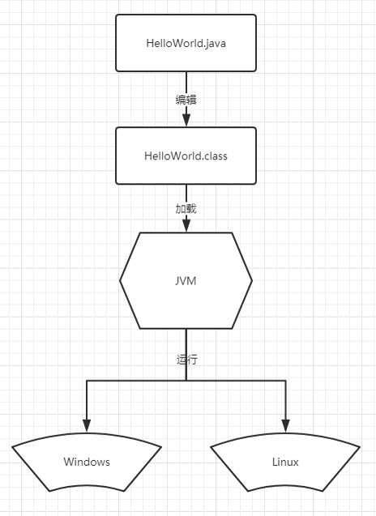

## JMM（Java Memory Model）

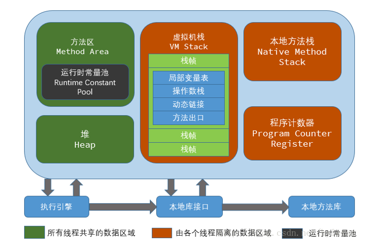

>JDK 1.7 之前，方法区实现为永久代；JDK 1.8 后，使用Meta Space（元空间代替）

### 程序计数器（PC）

> * 每个线程都会有自己私有的程序计数器(PC)。可以看作是当前线程所执行的字节码的行号指示器。 
>
> *  可以理解为下一条将要执行的指令的地址或者行号。字节码解释器就是通过改变这个计数器的值来选取下一条需要执行的字节码指令。分支、循环、 跳转、异常处理、上下文切换等，都要依赖PC。
>   * 执行Java 方法 – PC指向正在执行的虚拟机字节码指令地址
>   * 执行Native方法 – PC 为空。

### 虚拟机栈（VM Stack）

> * Java方法执行时的字典：记录局部变量表、操作数栈、动态链接、方法出口等信息。
> * 栈帧（ Frame）
>   * Java虚拟机栈的存储结构，是用来存储数据和部分过程结果的数据结构，同时也被用来处理动态链接 (Dynamic Linking)、 方法返回值和异常分派（ Dispatch Exception）。 
>   * 每一个栈帧都有自己的局部变量表（ Local Variables）、操作数栈（ OperandStack）和指向当前方法所属的类的运行时常量池的引用，随着方法调用而创建，随着方法结束而销毁。
>     * 局部变量表：是一组变量值存储空间，用于存放方法参数和方法内部定义的局部变量。在Java程序被编译为Class文件时，就在方法的Code属性的max_locals数据项中确定了方法所需要分配的最大局部变量表的容量。
>     * 操作数栈：还包含一个后进先出（Last-In-First-Out）的，也可以称之为表达式栈（Expression Stack），用于协助执行运算，如加减乘除。
>     * 动态链接：就是不对那些组成程序的[目标文件](https://baike.baidu.com/item/%E7%9B%AE%E6%A0%87%E6%96%87%E4%BB%B6)进行链接，等到程序要运行时才进行链接。也就是说，把链接这个过程推迟到了运行时再进行，这就是[动态链接](https://baike.baidu.com/item/%E5%8A%A8%E6%80%81%E9%93%BE%E6%8E%A5)(Dynamic Linking) 。
>     * 方法出口：方法返回值等

### 本地方法栈（Native Method Stack）

> * VM Stack是为执行Java方法服务的，此处的Native Method Stack是为执行本地方法服务的，有的虚拟机(比如 HotSpot )将VM Stack和Native Method Stack合二为一

### 堆（Heap）

> * 所有线程共享的内存区域，存储了被自动内存管理系统所管理的各种对象 
> * 包括年轻代、老年代

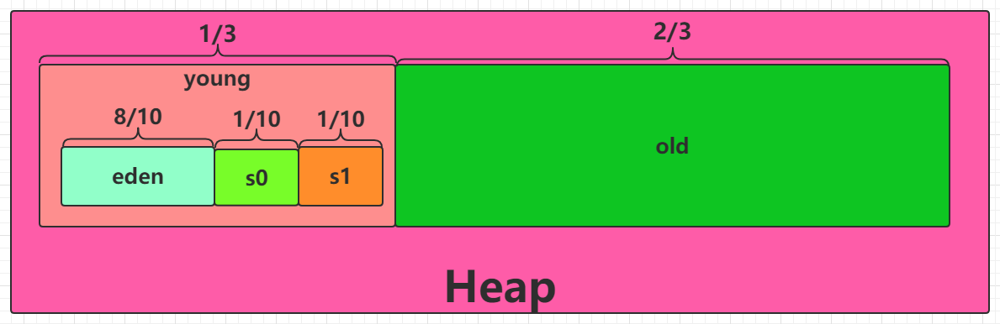

#### 年轻代（Young）

> * 存放new 出来的对象
> * 划分为三部分，Eden区和两个大小严格相同的Survivor区，其中Survivor区间中，某一时刻只有其中一个是被使用的，另外一个留做垃圾收集时复制对象用，在Young区间变满的时候，minor GC就会将存活的对象移到空闲的Survivor区间中。经过几次垃圾收集后，任然存活于Survivor的对象将被移动到Old区间。

####老年代（Old）

> * 保存生命周期长的对象，当一些对象在Young复制转移一定的次数以后，对象就会被转移到Old区

### 方法区（Method Area）

> * 所有线程共享的内存区域
> * 存放Class信息、静态变量、常量等
> * JDK 1.8 后，被Meta Space（元空间）代替

### 元空间（Meta Space）

> * JDK 1.8 后引入，代替永久代。
> * Meta Space 在Native Memory中，可以无限扩容（可以通过参数限制大小），解决java.lang.OutOfMemoryError : PermGen space 问题。

## GC 介绍

### Minor GC

> 年轻代GC
>
> 1. 回收Eden区对象，将遗留下来的对象放入Survivor区；
> 2. 将Survivor区对象整理后，放入另一半Survivor区；
> 3. 当Survivor区中对象超过年龄，将之放入Old区；
> 4. 当Survivor区中对象空间超过Survivor区一半大小时，将对象放入Old区。

### Major GC

> 老年代GC，通常由Young GC 触发，不会单独运行
>
> 1. 清除老年代中对象；
> 2. 清除方法区（JDK 1.7 -）或元空间（JDK 1.8 + ）中的对象。

### Full GC

> Minor GC + Major GC

### 判断对象是否需要回收 

#### 引用计数 

> * 引用计数存储对特定对象的所有引用数，也就是说，当应用程序创建引用以及引用超出范围时，JVM 必须增减引用数。当某对象的引用数为0时，便可以进行垃圾收集。 

#### 可达性分析

> * 对象引用从GC Root开始遍历，沿着对象引用链，递归确定可到达（reachable）的对象。如果某对象不能从这些GC Root的至少一个到达，则将它作为垃圾收集。 
> * 如下图，e、f、g、h、i，将被回收。

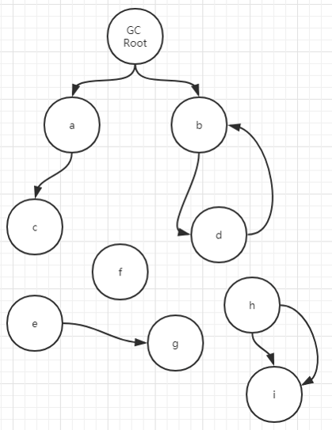

### GC 算法

#### 标记-清除 算法 

> 分为2个步骤：
>
> 1. 标记：标记的过程其实就是，遍历所有的GC Root，然后将所有GC Root可达的对象标记为存活的对象。
> 2. 清除：清除的过程将遍历堆中所有的对象，将没有标记的对象全部清除掉。

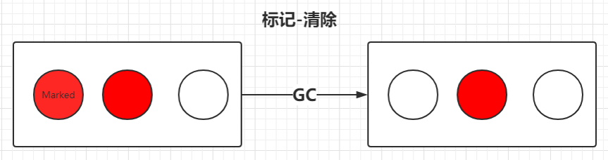

#### 复制 算法 

> * 将内存划分为两个区间，在任意时间点，所有动态分配的对象都只能分配在其中一个区间（称为活动区间），而另外一个区间（称为空闲区间）则是空闲的
> * GC发生时，将活动区间内的存活对象，全部复制到空闲区间，且严格按照内存地址依次排列，并将存活对象的内存引用地址指向新的内存地址。

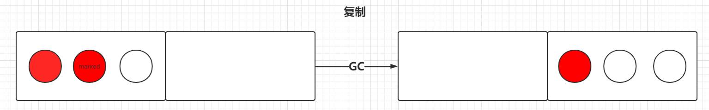

#### 标记-整理 算法

> 分为两个步骤：
>
> 1. 标记：它的第一个阶段与标记-清除算法是一模一样的，均是遍历GC Root，然后将存活的对象标记。
> 2. 整理：移动所有存活的对象，且按照内存地址次序依次排列，然后将末端内存地址以后的内存全部回收。

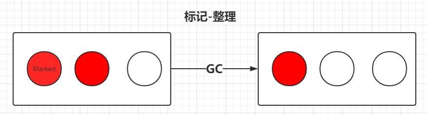

### GC 收集器

#### 分代收集

> 把Heap 分为年轻代和老年代，根据各自的特点采用不同的、合适的算法。 

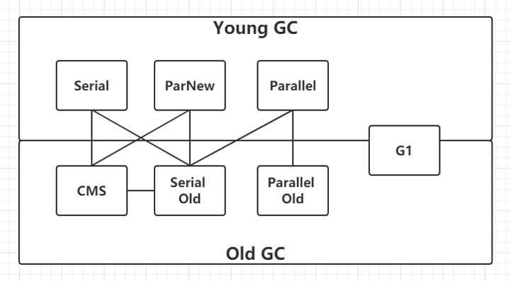

#### Serial 收集器

> * 串行收集器是最古老，最稳定以及效率高的收集器，可能会产生较长的停顿，只使用一个线程去回收。新生代、老年代使用串行回收。
> * 新生代复制算法、老年代标记-整理；
> * 垃圾收集的过程中会Stop The World（服务暂停）。

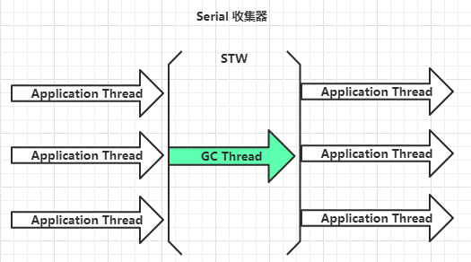

#### ParNew 收集器

> * ParNew收集器其实就是Serial 收集器的多线程版本。
> * 新生代并行，采用复制算法；
> * 垃圾收集的过程中会STW。

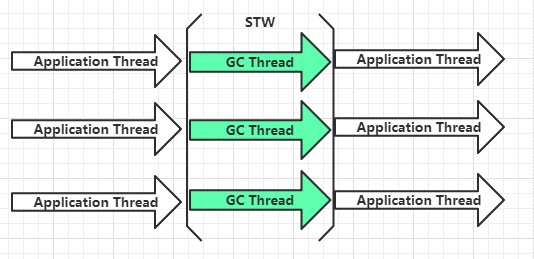

#### Parallel 收集器

> * 和ParNew 收集器类似，但更关注吞吐量。
> * 可以通过参数来打开自适应调节策略，虚拟机会根据当前系统的运行情况收集性能监控信息，动态调整这些参数以提供最合适的停顿时间或最大的吞吐量；也可以通过参数控制GC的时间不大于多少毫秒或者比例
> * 新生代并行，复制算法；老年代采用标记-整理 算法;
> * 垃圾收集的过程中会STW。 

#### CMS 收集器

> * 以最短回收停顿时间为目标的收集器，包括5个步骤
>   1. 初始标记（CMS Initial Mark）：标记一下GC Root 能直接关联到的对象，速度很快，期间STW；
>   2. 并发标记（CMS Concurrent Mark）：进行GC Root 遍历，找到所有可达对象；
>   3. 重新标记（CMS Remark）：修正并发标记期间，因用户程序继续运作而导致标记产生变动的那一部分对象的标记记录，期间STW；
>   4. 并发清除（CMS Concurrent Sweep）：清除不可达对象
>   5. 并发重置（CMS Concurrent Reset）：重置CMS收集器的数据结构，等待下一次垃圾回收.
> * 老年代使用，采用标记-清除 算法

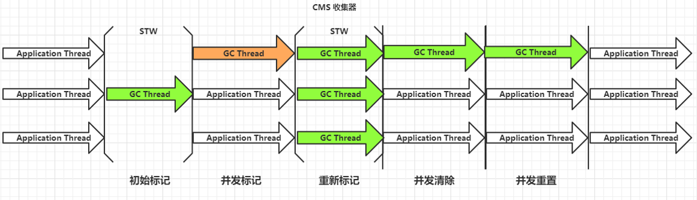

#### G1 收集器

> * G1 是目前技术发展的最前沿成果之一，HotSpot 开发团队赋予它的使命是未来可以替换掉JDK 1.5 中发布的CMS 收集器。与CMS 收集器相比G1 收集器有以下特点：
>   1. 空间整合，G1收集器采用标记-整理 算法，不会产生内存空间碎片。分配大对象时不会因为无法找到连续空间而提前触发下一次GC。
>   2. 可预测停顿，这是G1的另一大优势，降低停顿时间是G1和CMS的共同关注点，但G1除了追求低停顿外，还能建立可预测的停顿时间模型，能让使用者明确指定在一个长度为N毫秒的时间片段内，消耗在垃圾收集上的时间不得超过N毫秒，这几乎已经是实时Java（RTSJ）的垃圾收集器的特征了。
> * 使用G1收集器时，整个Java堆划分为多个大小相等的独立区域（Region），虽然还保留有新生代和老年代的概念，但新生代和老年代不再是物理隔阂了，它们都是一部分（可以不连续）Region的集合。

[G1 收集器介绍](http://blog.jobbole.com/109170/)

[Java Hotspot G1 GC的一些关键技术](https://tech.meituan.com/2016/09/23/g1.html)

## 内存分配策略

>**优先在TLAB（Thread Local Allocation Buffer 线程本地分配缓冲）中分配**
>
>**在Eden分配**
>
>**大对象直接进入老年代**：-XX:PretenureSizeThreshold参数可以配置
>
>**长期存活的对象进入老年代**：-XX:MaxTenuringThreshold可以配置年龄
>
>**动态对象年龄判定**：有的虚拟机不一定需要对象的年龄达到MaxTeruringThreshold才能晋升老年代。如果在Survivor空间中相同年龄所有对象大小的总和大于Surivior空间的一半，年龄大于或等于该年龄的对象就可以直接进行老年代。
>
>**空间分配担保**：在发生Minor GC之前，虚拟机会先检查老年代中最大的可用的连续空间是否大于新生代中所有对象总空间，如果这个条件成立，那么Minor GC可以确保是安全的。
>
>如果不成立，则虚拟机会查看HandlePromotionFaiure设置值是否允许担保失败。如果允许，那么会继续检查老年代最大可用的连续空间是否大于历次晋升到老年代对象的平均大小，如果大于，将尝试进行一次Minor GC，尽管这次GC是有风险的；如果小于，或者HandlePromotionFaiure设置不允许冒险，那么这时就要改为进行一次Full GC。 

## GC 发生条件

###Minor GC

> JVM 无法为新对象分配内存空间，比如Eden区满了

###Full GC

> * 方法区空间不足：Full GC之后永久代空间还是不足，系统就抛出：java.lang.OutOfMemoryError: PermGen space异常（1.7及以下）
> * 老年代空间不足：Minor GC 后进去老年代的空间大小 > 老年代剩余空间大小。如果进行FullGC后老年代依然无法容纳转入对象，那么系统就会抛出：java.lang.OutOfMemoryError: Java heap space异常。
> * 空间担保失败
> * 调用System.gc
> * promotion failed：Minor GC时，新生代中的对象从Eden区往survivor区转移，但是survivor区放不下，只能放入老年代，但是老年代也放不下，这时就会出现promotion failed的情况，触发Full GC。
> * concurrent mode failure：CMS GC过程中将对象放入老年代，但是老年代空间不足。

## JVM 调优

### GC 算法组合

| 新生代GC策略 | 年老代GC策略        | 说明             |                                                              |
| ------------ | ------------------- | ---------------- | ------------------------------------------------------------ |
| 组合1        | Serial              | Serial   Old     | Serial和Serial   Old都是单线程进行GC，特点就是GC时暂停所有应用线程。 |
| 组合2        | Serial              | CMS+Serial   Old | CMS（Concurrent   Mark Sweep）是并发GC，实现GC线程和应用线程并发工作，不需要暂停所有应用线程。另外，当CMS进行GC失败时，会自动使用Serial   Old策略进行GC。 |
| 组合3        | ParNew              | CMS              | 使用-XX:+UseParNewGC选项来开启。ParNew是Serial的并行版本，可以指定GC线程数，默认GC线程数为CPU的数量。可以使用-XX:ParallelGCThreads选项指定GC的线程数。   如果指定了选项-XX:+UseConcMarkSweepGC选项，则新生代默认使用ParNew   GC策略。 |
| 组合4        | ParNew              | Serial   Old     | 使用-XX:+UseParNewGC选项来开启。新生代使用ParNew   GC策略，年老代默认使用Serial Old GC策略。 |
| 组合5        | Parallel   Scavenge | Serial   Old     | Parallel   Scavenge策略主要是关注一个可控的吞吐量：应用程序运行时间 /   (应用程序运行时间 + GC时间)，可见这会使得CPU的利用率尽可能的高，适用于后台持久运行的应用程序，而不适用于交互较多的应用程序。 |
| 组合6        | Parallel   Scavenge | Parallel   Old   | Parallel   Old是Serial Old的并行版本                         |
| 组合7        | G1GC                | G1GC             | -XX:+UnlockExperimentalVMOptions   -XX:+UseG1GC        #开启      -XX:MaxGCPauseMillis   =50                  #暂停时间目标      -XX:GCPauseIntervalMillis   =200          #暂停间隔目标      -XX:+G1YoungGenSize=512m            #年轻代大小      -XX:SurvivorRatio=6                            #幸存区比例 |

### 详细JVM 参数

[JVM 参数](http://www.oracle.com/technetwork/java/javase/tech/vmoptions-jsp-140102.html )

## 参考文献

> http://www.oracle.com/technetwork/java/javase/tech/vmoptions-jsp-140102.html 
>
> [https://](https://blog.csdn.net/hylexus/article/details/53564865)[blog.csdn.net/hylexus/article/details/53564865](https://blog.csdn.net/hylexus/article/details/53564865) 
>
> [https://](https://www.cnblogs.com/ityouknow/p/5614961.html)[www.cnblogs.com/ityouknow/p/5614961.html](https://www.cnblogs.com/ityouknow/p/5614961.html) 
>
> [https://](https://www.cnblogs.com/ityouknow/p/5614961.html)[www.cnblogs.com/ityouknow/p/5614961.html](https://www.cnblogs.com/ityouknow/p/5614961.html)
>
> [https://](https://blog.csdn.net/wfh6732/article/details/57490195?utm_source=itdadao&utm_medium=referral)[blog.csdn.net/wfh6732/article/details/57490195?utm_source=itdadao&utm_medium=referra](https://blog.csdn.net/wfh6732/article/details/57490195?utm_source=itdadao&utm_medium=referral)
>
> https://blog.csdn.net/yhyr_ycy/article/details/52566105 
>
> [http://fengfu.io/2016/03/08/JVM%E8%A7%A6%E5%8F%91FullGC%E7%9A%84%E6%83%85%E5%86%B5%E6%80%BB%E7%BB%93/](http://fengfu.io/2016/03/08/JVM触发FullGC的情况总结/)
>
> https://www.cnblogs.com/zhouyuqin/p/5164672.html
>
> 《深入理解Java虚拟机》