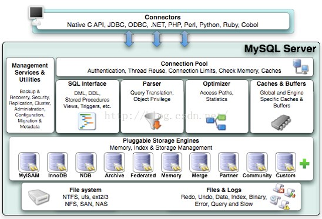
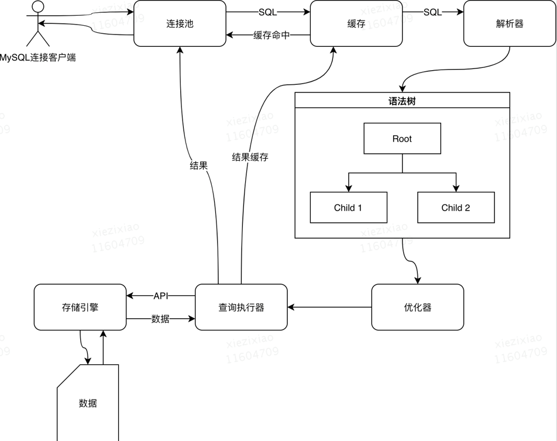
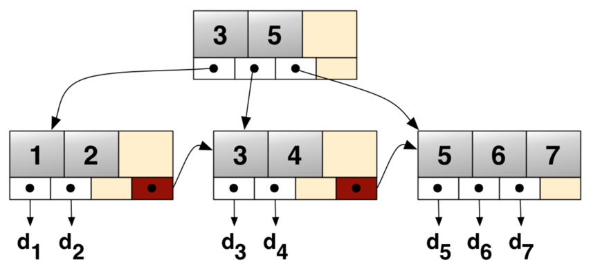
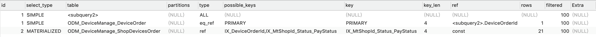

# MySQL笔记

## MySQL体系结构

- **Connector**：接入方连接器
- **Management Services & Utilities**：系统管理和控制工具，dump、分区管理等
- **Connection Pool**：连接池
- **Parser**：解析器
- **Optimizer**：查询优化器
- **Caches & Buffers**：缓存区
- **Pluggable Storage Engines**：插件式存储引擎

<!--more-->



### 执行顺序



## 存储引擎

- 可插拔式：插件式
- 表级：可每张表单独配置对应的存储引擎
- 不管表使用什么储存引擎，都会生成frm文件，存储表的定义

### CSV

- 不支持索引
- 列必须为not null
- 不能自增
- 数据存储格式为CSV文件，可以直接编辑

### Archive

- 数据文件格式为ARZ
- 会对数据进行压缩（zlib）
- 只支持insert和select操作
- MySQL 5.5之前不支持索引，5.5之后支持对自增ID列创建索引
- 行锁

### Memory

- 数据存储在内存中，服务重启会丢失
- 支持hash索引、B- Tree索引
- 所有字段长度固定（32），无法使用text、blob等大字段

### MyISAM

- MySQL 5.5之前默认引擎
- 不支持事务
- 不支持外键
- 3个表文件（frm：表定义；MYD：数据；MYI：索引）
- 非聚集索引
- 表锁
- 内置统计器统计数据变化，select count不加条件时无需进行数据扫描

### InnoDB

- MySQL 5.5之后默认引擎
- 支持事务
- 行锁
- 支持外键
- 主键索引：聚集索引；其他索引：非聚集索引

### 对比

| 功能          | MyISAM     | InnoDB                  |
| ------------- | ---------- | ----------------------- |
| B-tree   索引 | 支持       | 支持                    |
| 索引种类      | 非聚集索引 | 聚集索引 +   非聚集索引 |
| 数据压缩      | 支持       | 支持                    |
| 数据缓存      | -          | 支持                    |
| 索引缓存      | 支持       | 支持                    |
| 外键          | -          | 支持                    |
| 事务          | -          | 支持                    |
| 锁            | 表         | 行                      |
| MVCC          | -          | 支持                    |

## 索引

- 为了加快数据检索效率而存在的数据结构
- 可以减少扫描的数据量
- 可以将随机IO变为顺序IO
- 可以在特定的分组与排序时，避免使用临时表

### 聚集索引

数据物理存储顺序与键值顺序一致，如InnoDB主键索引

### 非聚集索引

数据存储顺序与键值顺序不一致，如MyiSAM索引，InnoDB非主键索引

### InnoDB索引数据结构

#### B+树

- 除了根之外的每个节点都包含最少包含[m/2]个元素，最多包含m个元素
- 对于任意节点，最多有m个子数
- 对于所有非叶子节点，元素数与子树数相等
- 所有的叶子节点都在相同的高度上，按顺序排列



### 离散性

字段离散性 = select distinct 字段 / select 字段

离散性越大，走索引时效率越高

### 覆盖索引

select 列能通过索引节点中的关键字直接返回

覆盖索引能将随机IO变为顺序IO，提高查询效率

### 几大原则

#### 最左匹配原则

索引匹配从最左字段开始，直到遇到<,>,<>，like等为止

#### 离散度高原则

离散度越大，索引筛选效率越高

#### 最少空间原则

创建索引的字段长度越小越好

#### 联合索引优先原则

联合索引筛选效率优于单值索引

### 执行计划

Explain + select SQL

#### 怎么查看

```mysql
EXPLAIN select * from table1 where Id in (select table1Id from table2 where table2Id = 1) 

```



##### Id

Id越大，越先执行

Id相同，从上往下执行

##### select_type

- **SIMPLE**：简单的select，不包含子查询和union
- **PRIMARY**：包含子查询或union，最外层查询为primary
- **SUBQUERY**：子查询
- **MATERIALIZED**：where in 的子查询
- **UNION**：union 后的查询
- **UNION RESULT**：从union结果中获取数据的select

##### Type

- **System**：查询系统表
- **Const**：走索引一次就找到了
- **Eq_ref**：通过唯一索引、主键索引扫描
- **Ref**：通过其他索引扫描，返回单一值的情况（=）
- **Range**：通过索引扫描，返回一个范围的数据（<>）
- **Index**：通过索引全表扫描
- **All**：全表扫描

执行效率

System > Const > eq_ref > ref> range > index > all

##### Table

查询表的名称或别名

##### Possible_keys

可能用到的索引

##### Key

实际用的索引

##### Rows

大致需要读取的行数

##### Filtered

返回行占rows的百分比

##### extra

- **Using index**：使用了覆盖索引
- **Using where**：使用了where过滤
- **Using temporary**：使用了临时表
- **Using filesort**：使用了外部文件进行排序，没有使用表内的索引
- **select tables optimized away**：使用了MyISAM等select count优化或基于索引的min、max优化，直接返回数据

## 事务

### ACID

- **原子性Atomicty**：数据修改要么一起成功，要么一起失败
- **一致性Consistency**：事务操作的数据变更及状态改变是一致的
- **隔离性Isolation**：一个事务的数据在提交前，对其他事务是不可见的
- **持久性Durability**：事务所做的变更，提交后将会永久保存

### 隔离级别

- **读未提交（Read Ucommitted）**：没提交的事务对其他事务也是可见的，可能遇到脏读（dirty read）
- **读提交（Read Committed）**：只能读取自己事务内的修改和其他事务已经提交的修改，可能遇到不可重复读（nonrepeatable read）
- **可重复读（Repeatable Read）**：同一事务多次读取同一数据的结果是一样的，可能遇到幻读（phantom read）
- **序列化（serializable）**：事务串行执行

### 锁

#### 共享锁（share lock）

读锁，多个事务可共享此锁，但是只能读数据，不可修改数据

锁行

#### 排它锁（exclusive lock）

写锁，不可与其他锁共存，获取排他锁后可以对数据进行读取和修改

锁行

#### 意向共享锁（intention share lock）

当事务想要给数据行加共享锁时，需要先取得此表的意向共享锁；意向共享锁之间是相互共享的

锁表

#### 意向排它锁（intention exclusive lock）

当事务想要给数据行加排他锁时，先要给表加意向排他锁；意向排他锁之间是互相共享的

锁表

#### 自增锁（auto-inc lock）

针对自增列加的特殊表锁

#### 记录锁（record lock）

锁住具体记录的索引项。走索引进行等值匹配，且能匹配到数据时使用

#### 间隙锁（gap lock）

锁住一段区间（左开右开）。走索引检索是，没有匹配到具体的记录时使用，只在RR隔离级别存在

#### 临键锁（Next key lock）

锁住具体记录即一段区间（左开右闭）。走索引进行范围查找，并能找到记录时使用。

### 多版本并发控制 MVCC（Multiversion concurrency control）

对事务内处理的数据做多版本管理，避免写操作对读操作的阻塞。

InnoDB MVCC在每张表会添加DB_TRX_ID（数据行事务版本号）、DB_ROLL_PT（数据行删除事务版本号）两个隐藏列

- 事务开始时，从系统获取事务全局ID
- 事务内insert数据的DB_TRX_ID字段为此事务ID
- 事务内delete数据的DB_ROLL_PT字段修改为此事务ID
- 事务内update的数据，将老数据的DB_ROLL_PT字段修改为此事务ID；Copy一条新数据出来，DB_TRX_ID字段为此事物ID
- 事务内查询的数据为DB_TRX_ID比当前事务ID小的数据 + DB_ROLL_PT为null或比当前事务ID大的数据

## 日志

### Redo log

记录事务操作的最新数据，用来实现持久化

### Uodo log

记录事务操作前的数据，用来实现原子性

### Bin log

记录会改变数据的操作日志，常用来做主从同步

### Error log

记录mysql服务的错误日志

### General log

记录客户端执行的sql语句

### Show log

记录慢查询和没走索引的sql

### Relay log

中继日志，常与bin log配合来做主从同步