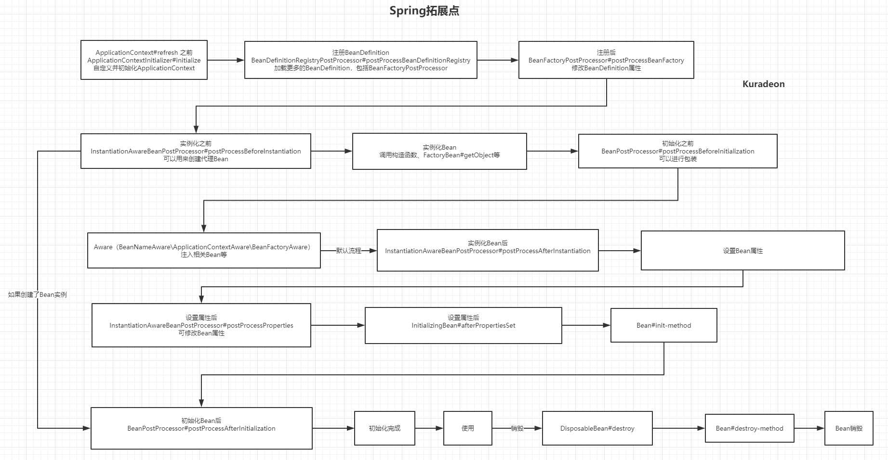

---

title: Spring 拓展点总结
keys: 20190513_Spring拓展点
tags: Spring 拓展点
author: Kuradeon
mail: 340620915@qq.com
---

# Spring 拓展点

## 定位

### ApplicationContextInitializer

```java
/**
 * Callback interface for initializing a Spring {@link ConfigurableApplicationContext}
 * prior to being {@linkplain ConfigurableApplicationContext#refresh() refreshed}.
 *
 * <p>Typically used within web applications that require some programmatic initialization
 * of the application context. For example, registering property sources or activating
 * profiles against the {@linkplain ConfigurableApplicationContext#getEnvironment()
 * context's environment}. See {@code ContextLoader} and {@code FrameworkServlet} support
 * for declaring a "contextInitializerClasses" context-param and init-param, respectively.
 *
 * <p>{@code ApplicationContextInitializer} processors are encouraged to detect
 * whether Spring's {@link org.springframework.core.Ordered Ordered} interface has been
 * implemented or if the @{@link org.springframework.core.annotation.Order Order}
 * annotation is present and to sort instances accordingly if so prior to invocation.
 *
 * @author Chris Beams
 * @since 3.1
 * @param <C> the application context type
 * @see org.springframework.web.context.ContextLoader#customizeContext
 * @see org.springframework.web.context.ContextLoader#CONTEXT_INITIALIZER_CLASSES_PARAM
 * @see org.springframework.web.servlet.FrameworkServlet#setContextInitializerClasses
 * @see org.springframework.web.servlet.FrameworkServlet#applyInitializers
 */
public interface ApplicationContextInitializer<C extends ConfigurableApplicationContext> {

   /**
    * Initialize the given application context.
    * @param applicationContext the application to configure
    */
   void initialize(C applicationContext);

}
```

在`ApplicationContext`调用`refresh()`之前提供回调，如实现自定义路径的资源加载。

## 注册

### BeanDefinitionRegistryPostProcessor

```java
/**
 * Extension to the standard {@link BeanFactoryPostProcessor} SPI, allowing for
 * the registration of further bean definitions <i>before</i> regular
 * BeanFactoryPostProcessor detection kicks in. In particular,
 * BeanDefinitionRegistryPostProcessor may register further bean definitions
 * which in turn define BeanFactoryPostProcessor instances.
 *
 * @author Juergen Hoeller
 * @since 3.0.1
 * @see org.springframework.context.annotation.ConfigurationClassPostProcessor
 */
public interface BeanDefinitionRegistryPostProcessor extends BeanFactoryPostProcessor {

   /**
    * Modify the application context's internal bean definition registry after its
    * standard initialization. All regular bean definitions will have been loaded,
    * but no beans will have been instantiated yet. This allows for adding further
    * bean definitions before the next post-processing phase kicks in.
    * @param registry the bean definition registry used by the application context
    * @throws org.springframework.beans.BeansException in case of errors
    */
   void postProcessBeanDefinitionRegistry(BeanDefinitionRegistry registry) throws BeansException;

}
```

`BeanDefinitionRegistryPostProcessor`继承了`BeanFactoryPostProcessor`，在`BeanDefinition`注册时候，`Bean`实例化之前回调。可以用来注册更多的`BeanDefinition`，也可以用来注册`BeanFactoryPostProcessor`的`BeanDefinition`。

```sequence
postProcessBeanDefinitionRegistry->postProcessBeanFactory:
```

### BeanFactoryPostProcessor

```java
/**
 * Allows for custom modification of an application context's bean definitions,
 * adapting the bean property values of the context's underlying bean factory.
 *
 * <p>Application contexts can auto-detect BeanFactoryPostProcessor beans in
 * their bean definitions and apply them before any other beans get created.
 *
 * <p>Useful for custom config files targeted at system administrators that
 * override bean properties configured in the application context.
 *
 * <p>See PropertyResourceConfigurer and its concrete implementations
 * for out-of-the-box solutions that address such configuration needs.
 *
 * <p>A BeanFactoryPostProcessor may interact with and modify bean
 * definitions, but never bean instances. Doing so may cause premature bean
 * instantiation, violating the container and causing unintended side-effects.
 * If bean instance interaction is required, consider implementing
 * {@link BeanPostProcessor} instead.
 *
 * @author Juergen Hoeller
 * @since 06.07.2003
 * @see BeanPostProcessor
 * @see PropertyResourceConfigurer
 */
@FunctionalInterface
public interface BeanFactoryPostProcessor {

	/**
	 * Modify the application context's internal bean factory after its standard
	 * initialization. All bean definitions will have been loaded, but no beans
	 * will have been instantiated yet. This allows for overriding or adding
	 * properties even to eager-initializing beans.
	 * @param beanFactory the bean factory used by the application context
	 * @throws org.springframework.beans.BeansException in case of errors
	 */
	void postProcessBeanFactory(ConfigurableListableBeanFactory beanFactory) throws BeansException;

}
```

`Bean`实例化之前，可以通过此拓展点读取`BeanDefinition`的配置信息。如其实现类`PropertyPlaceholderConfigurer`，可以读取外部`.properties`文件来设置`BeanDefinition`。

## 初始化、实例化

### InstantiationAwareBeanPostProcessor

```java
/**
 * Subinterface of {@link BeanPostProcessor} that adds a before-instantiation callback,
 * and a callback after instantiation but before explicit properties are set or
 * autowiring occurs.
 *
 * <p>Typically used to suppress default instantiation for specific target beans,
 * for example to create proxies with special TargetSources (pooling targets,
 * lazily initializing targets, etc), or to implement additional injection strategies
 * such as field injection.
 *
 * <p><b>NOTE:</b> This interface is a special purpose interface, mainly for
 * internal use within the framework. It is recommended to implement the plain
 * {@link BeanPostProcessor} interface as far as possible, or to derive from
 * {@link InstantiationAwareBeanPostProcessorAdapter} in order to be shielded
 * from extensions to this interface.
 *
 * @author Juergen Hoeller
 * @author Rod Johnson
 * @since 1.2
 * @see org.springframework.aop.framework.autoproxy.AbstractAutoProxyCreator#setCustomTargetSourceCreators
 * @see org.springframework.aop.framework.autoproxy.target.LazyInitTargetSourceCreator
 */
public interface InstantiationAwareBeanPostProcessor extends BeanPostProcessor {

   /**
    * Apply this BeanPostProcessor <i>before the target bean gets instantiated</i>.
    * The returned bean object may be a proxy to use instead of the target bean,
    * effectively suppressing default instantiation of the target bean.
    * <p>If a non-null object is returned by this method, the bean creation process
    * will be short-circuited. The only further processing applied is the
    * {@link #postProcessAfterInitialization} callback from the configured
    * {@link BeanPostProcessor BeanPostProcessors}.
    * <p>This callback will only be applied to bean definitions with a bean class.
    * In particular, it will not be applied to beans with a factory method.
    * <p>Post-processors may implement the extended
    * {@link SmartInstantiationAwareBeanPostProcessor} interface in order
    * to predict the type of the bean object that they are going to return here.
    * <p>The default implementation returns {@code null}.
    * @param beanClass the class of the bean to be instantiated
    * @param beanName the name of the bean
    * @return the bean object to expose instead of a default instance of the target bean,
    * or {@code null} to proceed with default instantiation
    * @throws org.springframework.beans.BeansException in case of errors
    * @see #postProcessAfterInstantiation
    * @see org.springframework.beans.factory.support.AbstractBeanDefinition#hasBeanClass
    */
   @Nullable
   default Object postProcessBeforeInstantiation(Class<?> beanClass, String beanName) throws BeansException {
      return null;
   }

   /**
    * Perform operations after the bean has been instantiated, via a constructor or factory method,
    * but before Spring property population (from explicit properties or autowiring) occurs.
    * <p>This is the ideal callback for performing custom field injection on the given bean
    * instance, right before Spring's autowiring kicks in.
    * <p>The default implementation returns {@code true}.
    * @param bean the bean instance created, with properties not having been set yet
    * @param beanName the name of the bean
    * @return {@code true} if properties should be set on the bean; {@code false}
    * if property population should be skipped. Normal implementations should return {@code true}.
    * Returning {@code false} will also prevent any subsequent InstantiationAwareBeanPostProcessor
    * instances being invoked on this bean instance.
    * @throws org.springframework.beans.BeansException in case of errors
    * @see #postProcessBeforeInstantiation
    */
   default boolean postProcessAfterInstantiation(Object bean, String beanName) throws BeansException {
      return true;
   }

   /**
    * Post-process the given property values before the factory applies them
    * to the given bean, without any need for property descriptors.
    * <p>Implementations should return {@code null} (the default) if they provide a custom
    * {@link #postProcessPropertyValues} implementation, and {@code pvs} otherwise.
    * In a future version of this interface (with {@link #postProcessPropertyValues} removed),
    * the default implementation will return the given {@code pvs} as-is directly.
    * @param pvs the property values that the factory is about to apply (never {@code null})
    * @param bean the bean instance created, but whose properties have not yet been set
    * @param beanName the name of the bean
    * @return the actual property values to apply to the given bean (can be the passed-in
    * PropertyValues instance), or {@code null} which proceeds with the existing properties
    * but specifically continues with a call to {@link #postProcessPropertyValues}
    * (requiring initialized {@code PropertyDescriptor}s for the current bean class)
    * @throws org.springframework.beans.BeansException in case of errors
    * @since 5.1
    * @see #postProcessPropertyValues
    */
   @Nullable
   default PropertyValues postProcessProperties(PropertyValues pvs, Object bean, String beanName)
         throws BeansException {

      return null;
   }

   /**
    * Post-process the given property values before the factory applies them
    * to the given bean. Allows for checking whether all dependencies have been
    * satisfied, for example based on a "Required" annotation on bean property setters.
    * <p>Also allows for replacing the property values to apply, typically through
    * creating a new MutablePropertyValues instance based on the original PropertyValues,
    * adding or removing specific values.
    * <p>The default implementation returns the given {@code pvs} as-is.
    * @param pvs the property values that the factory is about to apply (never {@code null})
    * @param pds the relevant property descriptors for the target bean (with ignored
    * dependency types - which the factory handles specifically - already filtered out)
    * @param bean the bean instance created, but whose properties have not yet been set
    * @param beanName the name of the bean
    * @return the actual property values to apply to the given bean (can be the passed-in
    * PropertyValues instance), or {@code null} to skip property population
    * @throws org.springframework.beans.BeansException in case of errors
    * @see #postProcessProperties
    * @see org.springframework.beans.MutablePropertyValues
    * @deprecated as of 5.1, in favor of {@link #postProcessProperties(PropertyValues, Object, String)}
    */
   @Deprecated
   @Nullable
   default PropertyValues postProcessPropertyValues(
         PropertyValues pvs, PropertyDescriptor[] pds, Object bean, String beanName) throws BeansException {

      return pvs;
   }

}
```

继承了`BeanPostProcessor`，在此基础上添加了实例化前、实例化后和处理`Bean`属性之前的拓展。通常用作创建代理。

### BeanPostProcessor

```java
/**
 * Factory hook that allows for custom modification of new bean instances,
 * e.g. checking for marker interfaces or wrapping them with proxies.
 *
 * <p>ApplicationContexts can autodetect BeanPostProcessor beans in their
 * bean definitions and apply them to any beans subsequently created.
 * Plain bean factories allow for programmatic registration of post-processors,
 * applying to all beans created through this factory.
 *
 * <p>Typically, post-processors that populate beans via marker interfaces
 * or the like will implement {@link #postProcessBeforeInitialization},
 * while post-processors that wrap beans with proxies will normally
 * implement {@link #postProcessAfterInitialization}.
 *
 * @author Juergen Hoeller
 * @since 10.10.2003
 * @see InstantiationAwareBeanPostProcessor
 * @see DestructionAwareBeanPostProcessor
 * @see ConfigurableBeanFactory#addBeanPostProcessor
 * @see BeanFactoryPostProcessor
 */
public interface BeanPostProcessor {

	/**
	 * Apply this BeanPostProcessor to the given new bean instance <i>before</i> any bean
	 * initialization callbacks (like InitializingBean's {@code afterPropertiesSet}
	 * or a custom init-method). The bean will already be populated with property values.
	 * The returned bean instance may be a wrapper around the original.
	 * <p>The default implementation returns the given {@code bean} as-is.
	 * @param bean the new bean instance
	 * @param beanName the name of the bean
	 * @return the bean instance to use, either the original or a wrapped one;
	 * if {@code null}, no subsequent BeanPostProcessors will be invoked
	 * @throws org.springframework.beans.BeansException in case of errors
	 * @see org.springframework.beans.factory.InitializingBean#afterPropertiesSet
	 */
	@Nullable
	default Object postProcessBeforeInitialization(Object bean, String beanName) throws BeansException {
		return bean;
	}

	/**
	 * Apply this BeanPostProcessor to the given new bean instance <i>after</i> any bean
	 * initialization callbacks (like InitializingBean's {@code afterPropertiesSet}
	 * or a custom init-method). The bean will already be populated with property values.
	 * The returned bean instance may be a wrapper around the original.
	 * <p>In case of a FactoryBean, this callback will be invoked for both the FactoryBean
	 * instance and the objects created by the FactoryBean (as of Spring 2.0). The
	 * post-processor can decide whether to apply to either the FactoryBean or created
	 * objects or both through corresponding {@code bean instanceof FactoryBean} checks.
	 * <p>This callback will also be invoked after a short-circuiting triggered by a
	 * {@link InstantiationAwareBeanPostProcessor#postProcessBeforeInstantiation} method,
	 * in contrast to all other BeanPostProcessor callbacks.
	 * <p>The default implementation returns the given {@code bean} as-is.
	 * @param bean the new bean instance
	 * @param beanName the name of the bean
	 * @return the bean instance to use, either the original or a wrapped one;
	 * if {@code null}, no subsequent BeanPostProcessors will be invoked
	 * @throws org.springframework.beans.BeansException in case of errors
	 * @see org.springframework.beans.factory.InitializingBean#afterPropertiesSet
	 * @see org.springframework.beans.factory.FactoryBean
	 */
	@Nullable
	default Object postProcessAfterInitialization(Object bean, String beanName) throws BeansException {
		return bean;
	}

}
```

其中`postProcessBeforeInitialization`在`bean`初始化前提供回调，`postProcessAfterInitialization`在`bean`初始化后提供回调。

可以通过`postProcessBeforeInitialization`自定义返回的`bean`实例；可以通过`postProcessAfterInitialization`在`bean`实例化后修改原有的`bean`，如对其包装等。

### Aware

```java
/**
 * A marker superinterface indicating that a bean is eligible to be notified by the
 * Spring container of a particular framework object through a callback-style method.
 * The actual method signature is determined by individual subinterfaces but should
 * typically consist of just one void-returning method that accepts a single argument.
 *
 * <p>Note that merely implementing {@link Aware} provides no default functionality.
 * Rather, processing must be done explicitly, for example in a
 * {@link org.springframework.beans.factory.config.BeanPostProcessor}.
 * Refer to {@link org.springframework.context.support.ApplicationContextAwareProcessor}
 * for an example of processing specific {@code *Aware} interface callbacks.
 *
 * @author Chris Beams
 * @author Juergen Hoeller
 * @since 3.1
 */
public interface Aware {

}
```

各种`Aware`的实现类都可提供拓展，下面介绍3种。

#### BeanNameAware

```java
/**
 * Interface to be implemented by beans that want to be aware of their
 * bean name in a bean factory. Note that it is not usually recommended
 * that an object depends on its bean name, as this represents a potentially
 * brittle dependence on external configuration, as well as a possibly
 * unnecessary dependence on a Spring API.
 *
 * <p>For a list of all bean lifecycle methods, see the
 * {@link BeanFactory BeanFactory javadocs}.
 *
 * @author Juergen Hoeller
 * @author Chris Beams
 * @since 01.11.2003
 * @see BeanClassLoaderAware
 * @see BeanFactoryAware
 * @see InitializingBean
 */
public interface BeanNameAware extends Aware {

	/**
	 * Set the name of the bean in the bean factory that created this bean.
	 * <p>Invoked after population of normal bean properties but before an
	 * init callback such as {@link InitializingBean#afterPropertiesSet()}
	 * or a custom init-method.
	 * @param name the name of the bean in the factory.
	 * Note that this name is the actual bean name used in the factory, which may
	 * differ from the originally specified name: in particular for inner bean
	 * names, the actual bean name might have been made unique through appending
	 * "#..." suffixes. Use the {@link BeanFactoryUtils#originalBeanName(String)}
	 * method to extract the original bean name (without suffix), if desired.
	 */
	void setBeanName(String name);

}
```

实现了该接口的`Bean`，在实例化之前会回调，获得`BeanName`。

#### ApplicationContextAware 

```java
/**
 * Interface to be implemented by any object that wishes to be notified
 * of the {@link ApplicationContext} that it runs in.
 *
 * <p>Implementing this interface makes sense for example when an object
 * requires access to a set of collaborating beans. Note that configuration
 * via bean references is preferable to implementing this interface just
 * for bean lookup purposes.
 *
 * <p>This interface can also be implemented if an object needs access to file
 * resources, i.e. wants to call {@code getResource}, wants to publish
 * an application event, or requires access to the MessageSource. However,
 * it is preferable to implement the more specific {@link ResourceLoaderAware},
 * {@link ApplicationEventPublisherAware} or {@link MessageSourceAware} interface
 * in such a specific scenario.
 *
 * <p>Note that file resource dependencies can also be exposed as bean properties
 * of type {@link org.springframework.core.io.Resource}, populated via Strings
 * with automatic type conversion by the bean factory. This removes the need
 * for implementing any callback interface just for the purpose of accessing
 * a specific file resource.
 *
 * <p>{@link org.springframework.context.support.ApplicationObjectSupport} is a
 * convenience base class for application objects, implementing this interface.
 *
 * <p>For a list of all bean lifecycle methods, see the
 * {@link org.springframework.beans.factory.BeanFactory BeanFactory javadocs}.
 *
 * @author Rod Johnson
 * @author Juergen Hoeller
 * @author Chris Beams
 * @see ResourceLoaderAware
 * @see ApplicationEventPublisherAware
 * @see MessageSourceAware
 * @see org.springframework.context.support.ApplicationObjectSupport
 * @see org.springframework.beans.factory.BeanFactoryAware
 */
public interface ApplicationContextAware extends Aware {

	/**
	 * Set the ApplicationContext that this object runs in.
	 * Normally this call will be used to initialize the object.
	 * <p>Invoked after population of normal bean properties but before an init callback such
	 * as {@link org.springframework.beans.factory.InitializingBean#afterPropertiesSet()}
	 * or a custom init-method. Invoked after {@link ResourceLoaderAware#setResourceLoader},
	 * {@link ApplicationEventPublisherAware#setApplicationEventPublisher} and
	 * {@link MessageSourceAware}, if applicable.
	 * @param applicationContext the ApplicationContext object to be used by this object
	 * @throws ApplicationContextException in case of context initialization errors
	 * @throws BeansException if thrown by application context methods
	 * @see org.springframework.beans.factory.BeanInitializationException
	 */
	void setApplicationContext(ApplicationContext applicationContext) throws BeansException;

}
```

实现了该接口的`Bean`，在初始化后，会被注入`ApplicationContext`。

#### BeanFactoryAware

```java
/**
 * Interface to be implemented by beans that wish to be aware of their
 * owning {@link BeanFactory}.
 *
 * <p>For example, beans can look up collaborating beans via the factory
 * (Dependency Lookup). Note that most beans will choose to receive references
 * to collaborating beans via corresponding bean properties or constructor
 * arguments (Dependency Injection).
 *
 * <p>For a list of all bean lifecycle methods, see the
 * {@link BeanFactory BeanFactory javadocs}.
 *
 * @author Rod Johnson
 * @author Chris Beams
 * @since 11.03.2003
 * @see BeanNameAware
 * @see BeanClassLoaderAware
 * @see InitializingBean
 * @see org.springframework.context.ApplicationContextAware
 */
public interface BeanFactoryAware extends Aware {

	/**
	 * Callback that supplies the owning factory to a bean instance.
	 * <p>Invoked after the population of normal bean properties
	 * but before an initialization callback such as
	 * {@link InitializingBean#afterPropertiesSet()} or a custom init-method.
	 * @param beanFactory owning BeanFactory (never {@code null}).
	 * The bean can immediately call methods on the factory.
	 * @throws BeansException in case of initialization errors
	 * @see BeanInitializationException
	 */
	void setBeanFactory(BeanFactory beanFactory) throws BeansException;

}
```

实现了此接口的`Bean`，在处理属性之后，初始化之前，会回调注入`BeanFactory`。

### InitializingBean

```java
/**
 * Interface to be implemented by beans that need to react once all their properties
 * have been set by a {@link BeanFactory}: e.g. to perform custom initialization,
 * or merely to check that all mandatory properties have been set.
 *
 * <p>An alternative to implementing {@code InitializingBean} is specifying a custom
 * init method, for example in an XML bean definition. For a list of all bean
 * lifecycle methods, see the {@link BeanFactory BeanFactory javadocs}.
 *
 * @author Rod Johnson
 * @author Juergen Hoeller
 * @see DisposableBean
 * @see org.springframework.beans.factory.config.BeanDefinition#getPropertyValues()
 * @see org.springframework.beans.factory.support.AbstractBeanDefinition#getInitMethodName()
 */
public interface InitializingBean {

   /**
    * Invoked by the containing {@code BeanFactory} after it has set all bean properties
    * and satisfied {@link BeanFactoryAware}, {@code ApplicationContextAware} etc.
    * <p>This method allows the bean instance to perform validation of its overall
    * configuration and final initialization when all bean properties have been set.
    * @throws Exception in the event of misconfiguration (such as failure to set an
    * essential property) or if initialization fails for any other reason
    */
   void afterPropertiesSet() throws Exception;

}
```

在`Bean`被注入所有的属性之后回调。

### DisposableBean

```java
/**
 * Interface to be implemented by beans that want to release resources on destruction.
 * A {@link BeanFactory} will invoke the destroy method on individual destruction of a
 * scoped bean. An {@link org.springframework.context.ApplicationContext} is supposed
 * to dispose all of its singletons on shutdown, driven by the application lifecycle.
 *
 * <p>A Spring-managed bean may also implement Java's {@link AutoCloseable} interface
 * for the same purpose. An alternative to implementing an interface is specifying a
 * custom destroy method, for example in an XML bean definition. For a list of all
 * bean lifecycle methods, see the {@link BeanFactory BeanFactory javadocs}.
 *
 * @author Juergen Hoeller
 * @since 12.08.2003
 * @see InitializingBean
 * @see org.springframework.beans.factory.support.RootBeanDefinition#getDestroyMethodName()
 * @see org.springframework.beans.factory.config.ConfigurableBeanFactory#destroySingletons()
 * @see org.springframework.context.ConfigurableApplicationContext#close()
 */
public interface DisposableBean {

	/**
	 * Invoked by the containing {@code BeanFactory} on destruction of a bean.
	 * @throws Exception in case of shutdown errors. Exceptions will get logged
	 * but not rethrown to allow other beans to release their resources as well.
	 */
	void destroy() throws Exception;

}
```

在`Bean`销毁前提供回调。

### FactoryBean

```java
/**
 * Interface to be implemented by objects used within a {@link BeanFactory} which
 * are themselves factories for individual objects. If a bean implements this
 * interface, it is used as a factory for an object to expose, not directly as a
 * bean instance that will be exposed itself.
 *
 * <p><b>NB: A bean that implements this interface cannot be used as a normal bean.</b>
 * A FactoryBean is defined in a bean style, but the object exposed for bean
 * references ({@link #getObject()}) is always the object that it creates.
 *
 * <p>FactoryBeans can support singletons and prototypes, and can either create
 * objects lazily on demand or eagerly on startup. The {@link SmartFactoryBean}
 * interface allows for exposing more fine-grained behavioral metadata.
 *
 * <p>This interface is heavily used within the framework itself, for example for
 * the AOP {@link org.springframework.aop.framework.ProxyFactoryBean} or the
 * {@link org.springframework.jndi.JndiObjectFactoryBean}. It can be used for
 * custom components as well; however, this is only common for infrastructure code.
 *
 * <p><b>{@code FactoryBean} is a programmatic contract. Implementations are not
 * supposed to rely on annotation-driven injection or other reflective facilities.</b>
 * {@link #getObjectType()} {@link #getObject()} invocations may arrive early in
 * the bootstrap process, even ahead of any post-processor setup. If you need access
 * other beans, implement {@link BeanFactoryAware} and obtain them programmatically.
 *
 * <p>Finally, FactoryBean objects participate in the containing BeanFactory's
 * synchronization of bean creation. There is usually no need for internal
 * synchronization other than for purposes of lazy initialization within the
 * FactoryBean itself (or the like).
 *
 * @author Rod Johnson
 * @author Juergen Hoeller
 * @since 08.03.2003
 * @param <T> the bean type
 * @see org.springframework.beans.factory.BeanFactory
 * @see org.springframework.aop.framework.ProxyFactoryBean
 * @see org.springframework.jndi.JndiObjectFactoryBean
 */
public interface FactoryBean<T> {

	/**
	 * Return an instance (possibly shared or independent) of the object
	 * managed by this factory.
	 * <p>As with a {@link BeanFactory}, this allows support for both the
	 * Singleton and Prototype design pattern.
	 * <p>If this FactoryBean is not fully initialized yet at the time of
	 * the call (for example because it is involved in a circular reference),
	 * throw a corresponding {@link FactoryBeanNotInitializedException}.
	 * <p>As of Spring 2.0, FactoryBeans are allowed to return {@code null}
	 * objects. The factory will consider this as normal value to be used; it
	 * will not throw a FactoryBeanNotInitializedException in this case anymore.
	 * FactoryBean implementations are encouraged to throw
	 * FactoryBeanNotInitializedException themselves now, as appropriate.
	 * @return an instance of the bean (can be {@code null})
	 * @throws Exception in case of creation errors
	 * @see FactoryBeanNotInitializedException
	 */
	@Nullable
	T getObject() throws Exception;

	/**
	 * Return the type of object that this FactoryBean creates,
	 * or {@code null} if not known in advance.
	 * <p>This allows one to check for specific types of beans without
	 * instantiating objects, for example on autowiring.
	 * <p>In the case of implementations that are creating a singleton object,
	 * this method should try to avoid singleton creation as far as possible;
	 * it should rather estimate the type in advance.
	 * For prototypes, returning a meaningful type here is advisable too.
	 * <p>This method can be called <i>before</i> this FactoryBean has
	 * been fully initialized. It must not rely on state created during
	 * initialization; of course, it can still use such state if available.
	 * <p><b>NOTE:</b> Autowiring will simply ignore FactoryBeans that return
	 * {@code null} here. Therefore it is highly recommended to implement
	 * this method properly, using the current state of the FactoryBean.
	 * @return the type of object that this FactoryBean creates,
	 * or {@code null} if not known at the time of the call
	 * @see ListableBeanFactory#getBeansOfType
	 */
	@Nullable
	Class<?> getObjectType();

	/**
	 * Is the object managed by this factory a singleton? That is,
	 * will {@link #getObject()} always return the same object
	 * (a reference that can be cached)?
	 * <p><b>NOTE:</b> If a FactoryBean indicates to hold a singleton object,
	 * the object returned from {@code getObject()} might get cached
	 * by the owning BeanFactory. Hence, do not return {@code true}
	 * unless the FactoryBean always exposes the same reference.
	 * <p>The singleton status of the FactoryBean itself will generally
	 * be provided by the owning BeanFactory; usually, it has to be
	 * defined as singleton there.
	 * <p><b>NOTE:</b> This method returning {@code false} does not
	 * necessarily indicate that returned objects are independent instances.
	 * An implementation of the extended {@link SmartFactoryBean} interface
	 * may explicitly indicate independent instances through its
	 * {@link SmartFactoryBean#isPrototype()} method. Plain {@link FactoryBean}
	 * implementations which do not implement this extended interface are
	 * simply assumed to always return independent instances if the
	 * {@code isSingleton()} implementation returns {@code false}.
	 * <p>The default implementation returns {@code true}, since a
	 * {@code FactoryBean} typically manages a singleton instance.
	 * @return whether the exposed object is a singleton
	 * @see #getObject()
	 * @see SmartFactoryBean#isPrototype()
	 */
	default boolean isSingleton() {
		return true;
	}

}
```

`FactoryBean`为工厂`Bean`，通过`getObject`才会返回实际的`Bean`。可以通过它

来构建、自定义`Bean`。可以通过`&BeanName`获取`FactoryBean`本身。

如`Bean`初始化逻辑十分复杂，可以使用`FactoryBean`来初始化你的`Bean`。Mybatis的`SqlSessionFactoryBean`就是使用了此拓展点。

### BeanDefinition拓展

`init-method()`和`destory-method()`分别在初始化前和关闭`Bean`后调用。

## 小结



## ApplicationListener

```java
/**
 * Interface to be implemented by application event listeners.
 * Based on the standard {@code java.util.EventListener} interface
 * for the Observer design pattern.
 *
 * <p>As of Spring 3.0, an ApplicationListener can generically declare the event type
 * that it is interested in. When registered with a Spring ApplicationContext, events
 * will be filtered accordingly, with the listener getting invoked for matching event
 * objects only.
 *
 * @author Rod Johnson
 * @author Juergen Hoeller
 * @param <E> the specific ApplicationEvent subclass to listen to
 * @see org.springframework.context.event.ApplicationEventMulticaster
 */
@FunctionalInterface
public interface ApplicationListener<E extends ApplicationEvent> extends EventListener {

   /**
    * Handle an application event.
    * @param event the event to respond to
    */
   void onApplicationEvent(E event);

}
```

`ApplicationEvent`事件监听。

## 参考文献

[Spring扩展点总结](<http://blog.gavinzh.com/2017/11/20/spring-develop-summary/>)

[springboot(5)提供的扩展接口](<https://blog.csdn.net/zhaocuit/article/details/83784079>)